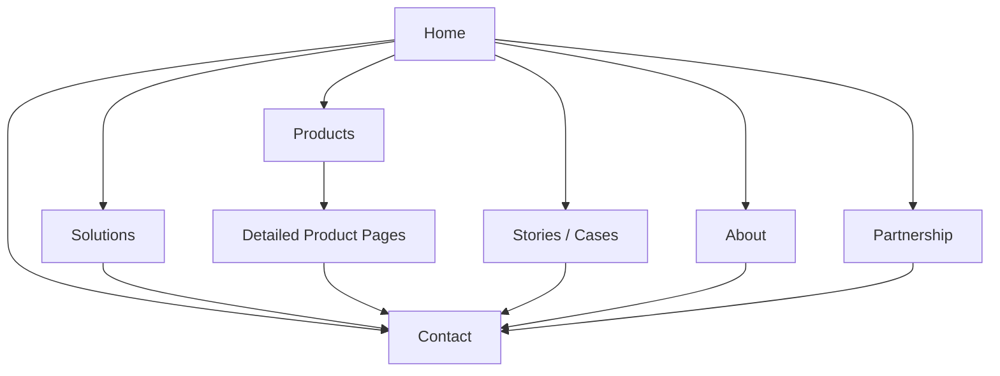

# B2B 官网结构说明：如何用官网承接信任、筛选客户并形成线索

## 正文版

### 1. 开场说明

这份文档不是设计稿说明，也不是开发任务单。它服务于管理层判断一件事：一个 B2B 官网应该如何组织内容，才能既建立信任，又形成获客入口。

官网不是公司介绍册，也不是纯产品页。一个真正有效的官网，本质上是一个面向外部客户、合作伙伴和潜在线索的筛选与转化入口。它要在很短的浏览时间内帮助访客回答四个问题：

- 你是谁
- 你解决什么问题
- 为什么你可信
- 下一步怎么联系你

因此，官网结构并不是在“堆页面”，而是在设计一条更高效的线索转化路径。页面顺序越清楚，访客越容易继续看下去；角色分工越明确，官网越能同时承担品牌、信任和获客三类任务。

### 2. 官网的四个核心目标

#### 建立可信度

官网首先要降低第一次接触的心理门槛。对于 B2B 业务来说，客户不会因为页面好看就愿意继续沟通，他们更关心这家公司是否真实、有经验、能交付、值得花时间了解。  
为什么有助于获客：可信度越早建立，销售和商务的第一次沟通阻力越低。

#### 帮客户快速理解主营业务和重点能力

访客不会主动帮公司梳理价值。他们只会扫读页面，并迅速判断“这家公司是不是做我关心的东西”。官网必须用清楚的业务语言，而不是泛化口号，让客户快速看懂主营业务和最值得聊的能力方向。  
为什么有助于获客：重点能力越清楚，客户越容易完成自我匹配。

#### 帮客户找到最相关的切入口

客户进入官网时，关注点并不相同。有的人关心解决方案，有的人关心产品，有的人关心合作方式，还有的人需要先看案例或公司背景。官网必须给出清楚的入口，而不是让所有人都从同一段总介绍开始。  
为什么有助于获客：切入口越明确，访客越不容易在中途流失。

#### 把浏览行为转成明确沟通或线索

如果官网只有介绍，没有收口，那它只能停留在“被看过”。有效官网一定要在合适的位置给出下一步动作，比如联系、预约沟通、提交需求、申请演示或查看详细介绍。  
为什么有助于获客：明确 CTA 能把兴趣转成可跟进动作。

### 3. 推荐官网结构

一个适合 B2B 获客的官网，建议至少包含以下 7 个一级页面：

#### `Home`

作用：首屏抓住注意力，快速建立信任，并给出继续浏览路径。  
获客价值：决定访客是否愿意继续看。

#### `Solutions`

作用：把能力翻译成客户可理解的问题与方案入口。  
获客价值：帮助客户完成“这和我有没有关系”的判断。

#### `Products`

作用：集中展示产品、产品化能力和合作伙伴产品。  
获客价值：让产品成为前端获客抓手，但不替代整体官网定位。

这里要特别强调一条原则：`Products` 页不是整个官网本身，它只是官网里的一个模块。重点产品可以前置，但不能吞掉官网整体叙事。

#### `Partnership`

作用：说明合作方式、联合推进模式以及适合哪类伙伴。  
获客价值：吸引渠道、生态、联合交付类机会。

#### `Stories / Cases`

作用：用真实案例说明问题、推进方式和结果。  
获客价值：把“你说你能做”变成“你做过类似事情”。

#### `About`

作用：补充公司背景、规模、积累和可信度。  
获客价值：为管理层客户、高客单价项目和高信任门槛机会提供背书。

#### `Contact`

作用：收口，承接线索。  
获客价值：把阅读路径变成明确动作。

### 4. 首页为什么要这样排

首页不是目录页，也不是公司历史页。它是整个官网最重要的获客入口，因此区块顺序必须服务于“愿意继续看”和“愿意联系”。

推荐顺序如下。

#### 1. `Hero`

放入：一句清楚的业务价值表达，加上两个 CTA。  
为什么适合获客：首屏必须先讲客户能推进什么，而不是先讲公司历史。客户只会先看“这和我有什么关系”，不会先看“你成立于哪一年”。

#### 2. `能力标签 / 证明横幅`

放入：行业积累、能力标签、关键场景、代表经验。  
为什么适合获客：这一层能让客户在极短时间内形成“这家公司做过实事”的印象，是快速建立第一轮信任的高效方式。

#### 3. `公司与能力背书`

放入：成立时间、团队规模、行业经验、代表能力。  
为什么适合获客：这一段的作用不是完整介绍公司，而是用少量高价值事实建立可信度，避免客户怀疑交付能力或资源深度。

#### 4. `我们擅长解决的问题`

放入：3 到 5 个优先业务方向。  
为什么适合获客：比抽象能力介绍更容易让客户对号入座。客户通常是带着问题来的，不是带着技术关键词来的。

#### 5. `解决方案选择区`

放入：分类后的方案入口。  
为什么适合获客：不同类型访客可以快速找到自己关心的主题，减少跳出和无效浏览。

#### 6. `重点产品 / 重点合作产品`

放入：当前最适合对外展示和前端获客的产品。  
为什么适合获客：产品是最容易被理解、被传播、被拿来做演示和前端切入的抓手。但它应该作为切入口，而不是整站主身份。

#### 7. `案例预览`

放入：1 到 3 个代表性故事。  
为什么适合获客：让访客看到你不只是“能讲”，而是“做成过”。这一层是从“可信”走向“可验证”的关键。

#### 8. `About 预览`

放入：补充性的公司可信度说明。  
为什么适合获客：这一段服务于高信任门槛客户，但不应放在首页最前面，否则容易把首页写成公司介绍展板。

#### 9. `最终 CTA`

放入：联系、预约沟通、提交需求、申请演示。  
为什么适合获客：如果没有明确下一步，前面所有内容都只能停留在浏览层，无法进入线索管理流程。

### 5. 产品页的写法原则

管理层在看产品页时，最容易出现一个误区：把“重点产品前置”理解成“官网应该围绕单一产品重写”。这两件事并不相同。

一个适合获客的 `Products` 页，应同时容纳三类内容：

- 自有产品
- 产品化能力
- 合作伙伴产品

重点产品可以放前面，但不能把其他产品删掉。原因很简单：重点产品负责提升前端获客效率，而完整产品页负责保留公司的业务宽度和后续扩展空间。

因此，产品页的任务是：

- 展示产品菜单
- 帮客户判断哪个值得深入看
- 把重点产品导向详细介绍页

而详细产品页的任务才是：

- 展开讲清产品价值
- 拆子模块或子产品
- 放试用、演示或联系入口

这里的固定原则应该写清楚：

> `重点产品前置` 是为了提升获客效率，不是为了把官网变成单产品官网。

### 6. 为什么这套结构适合迁移到别的项目

这套结构可复用，不是因为它适合某个具体行业，而是因为它抓住了 B2B 官网的共性任务：

- 先建立信任
- 再帮助客户自我匹配
- 再给出具体切入口
- 最后把兴趣转成动作

无论是软件、平台、咨询、交付还是联合方案型业务，只要官网承担的是“外部解释 + 商务转化”任务，这套结构都成立。真正需要替换的，通常只是行业名、产品名、案例名和能力标签，而不是页面职责本身。

### 7. 管理层如何判断官网结构是否合理

管理层可以用以下 5 条标准做快速判断：

- 访客是否能在短时间内知道公司最擅长什么
- 是否存在清晰的业务切入口，而不是只有泛化介绍
- 重点产品是否被利用为获客抓手，而不是被孤立展示
- 页面顺序是否服务于“继续看下去”和“愿意联系”
- 是否能把公司背书、解决方案、产品和案例串成一条线索路径

如果这 5 条无法同时满足，通常说明官网结构不是过于总部化，就是过于产品化，或者只是停留在展示层，没有真正服务获客。

## 附录版

### A. 官网结构图

说明：

- `Home` 负责承接第一印象和继续浏览
- `Solutions`、`Products`、`Stories`、`About`、`Partnership` 分别承接不同类型的兴趣
- 所有路径最终都应汇聚到 `Contact` 或其他明确收口动作
- `Detailed Product Pages` 只属于产品页之后的深入层，不应替代官网整体结构

### B. 模块与获客作用映射表

| 模块名 | 访客在这一页想知道什么 | 页面应该放什么 | 对获客的作用 | 不应该怎么写 |
| --- | --- | --- | --- | --- |
| Home | 你是谁，值不值得继续看 | 价值表达、能力标签、背书、入口、CTA | 决定是否继续浏览 | 一上来写成长篇公司介绍 |
| Solutions | 你解决什么问题 | 业务问题、方案入口、适合谁 | 帮客户完成自我匹配 | 只写能力名词，不写问题 |
| Products | 你有哪些产品或产品化能力 | 自有产品、产品化能力、合作伙伴产品 | 提供前端产品抓手 | 把重点产品写成唯一产品 |
| Detailed Product Pages | 这个产品到底值不值得进一步聊 | 产品价值、子模块、入口、试用/演示 | 承接高意向兴趣 | 没有明确下一步动作 |
| Partnership | 你们怎么合作 | 合作方式、联合推进模式、适合对象 | 吸引渠道与联合机会 | 写成另一版公司介绍 |
| Stories / Cases | 你们有没有做过类似事情 | 客户场景、问题、做法、结果 | 把可信度转成可验证性 | 只有结果，没有过程 |
| About | 你们到底靠不靠谱 | 背景、规模、积累、经验 | 服务高信任门槛客户 | 抢占首页主叙事 |
| Contact | 我现在怎么继续 | 联系方式、表单、预约动作 | 把兴趣变成线索 | 藏得太深或表达不明确 |

### C. 复用时只需要替换的内容

如果要把这份文档迁移到别的项目，通常只需要替换以下内容：

- 行业与客户类型
- 重点解决方案名称
- 产品名称与重点产品排序
- 合作方式表达
- 案例名称与案例结构
- 联系动作类型，例如联系、预约演示、提交需求、申请试用

不建议轻易改动的，是页面角色和顺序逻辑。因为这些内容直接决定官网是否真正服务获客，而不是只停留在展示层。
